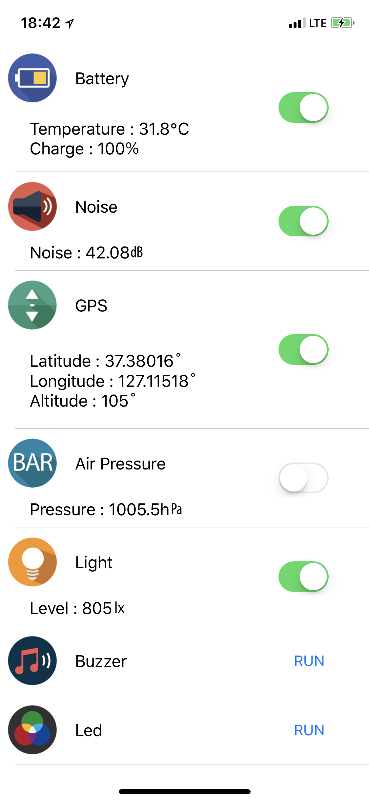

Service App

===
Service App 은 ThingPlug Simple SDK를 이용한 ThingPlug IoT Device의 원격 상태조회, 제어가 가능한 App 입니다.

## 동작
앱 실행시  
   - ThingPlug 에 등록된 IoT Device의 원격 상태조회, 제어가 가능한 화면을 보여 줍니다.
   

Copyright (c) 2017 SK Telecom Co., Ltd. All Rights Reserved.
